<div align="center">

# ◆ AION — the eternal agent

**A terminal AI agent with a real brain: it remembers, dreams, deliberates — and evolves.**

[](package.json)
[](https://nodejs.org)
[](LICENSE)
[](#)
[](.github/workflows/ci.yml)
[](test/)

*Hermes delivers messages. OpenClaw follows orders.*
***Aion is eternity itself — the agent that doesn't just grow with you, it evolves.***



</div>

---

## Install

**Windows** (PowerShell — installs Node.js automatically if missing):

```powershell
irm https://raw.githubusercontent.com/razekeks1/aion/main/install.ps1 | iex
```

**macOS / Linux**:

```sh
curl -fsSL https://raw.githubusercontent.com/razekeks1/aion/main/install.sh | sh
```

Or the classic way: `git clone https://github.com/razekeks1/aion && cd aion && npm install -g .`

Then, from **any** terminal:

```cmd
aion
```

That's the whole install. **Zero npm dependencies** — pure Node.js ≥ 18, no build step, no compiler.
First launch runs a setup wizard: connect **Ollama** (local or Ollama Cloud), optionally add Anthropic, OpenAI (incl. Codex), Google, OpenRouter, Groq, xAI, Mistral, MiniMax, DeepSeek or Moonshot/Kimi, pick your models, optionally link **Telegram** — done. A short animated feature tour shows you around. Re-run `aion setup` anytime: it shows every current setting and Enter keeps it.

---

## Why this isn't just another chat CLI

### 🧬 Evolution Engine
Aion reads your reactions — *"perfect, thanks!"*, *"no, that's wrong"* (English, German and more) — as feedback signals. During dream cycles it **rewrites its own behavioral genome**: rules injected into every future system prompt, each with a confidence score that grows as rules survive successive dreams.

```text
❯ /genome
 1 ████░  78% Always include runnable commands, not just prose 📌
 2 ███░░  65% Prefer PowerShell over cmd in examples
 3 ██░░░  50% Keep answers under 10 lines for quick questions
```

Pin a rule (`/genome pin 1`) and it becomes immortal — it survives dreams *and* resets.

### 🏛 Council Mode
`/council <question>` makes **multiple models deliberate in parallel** — an Analyst, a Critic and a Visionary, each on a different model — then a chairperson synthesizes one superior answer. `/council` with no argument re-deliberates your last prompt. Seats are fully configurable in `config.json`:

```jsonc
"council": { "seats": [
  { "role": "Skeptic",  "style": "doubt everything", "model": "ollama:glm-4.6:cloud" },
  { "role": "Engineer", "style": "think in tradeoffs", "model": "anthropic:claude-sonnet-4-6" }
]}
```

### 💤 Triadic Memory + Dream Cycle
Three memory systems, like a brain: **episodic** (what happened), **semantic** (what is true), **procedural** (how to do things). On exit — or with `/dream` — Aion consolidates: episodes compress into durable facts, duplicates merge, stale memories decay and prune. Recall is hybrid trigram-cosine + keyword scoring: offline, multilingual, instant, no embedding model needed.

### ⚡ Aegis Resilience
Model overloaded? Rate-limited? Network blip? Aion retries with backoff, then **fails over to backup models mid-turn**. An error has never killed a conversation since.

### 🧠 Neural Router
Simple turns route to your fast/local model, hard ones to the flagship — automatically, by analyzing the prompt. Faster *and* cheaper, toggle with `/router`.

### 🎯 Goal mode & loops
`/goal <mission>` puts Aion into autonomous mode: it works toward the goal in iterations — using tools, verifying its own results — and only stops when it confirms completion (or hits the 15-iteration safety limit; `Esc` interrupts, `/goal resume` continues, `/goal clear` stops). `/loop 10m <prompt>` re-runs a prompt on a schedule; `/loop <prompt>` without an interval is **self-paced** — Aion decides when the next run makes sense. A live countdown sits in the status bar.

```text
❯ /goal refactor utils.py, run the tests, fix everything until green
🎯 goal set — working autonomously, max 15 iterations
```

### 📱 Telegram — your agent in your pocket
Link a bot once (`aion telegram setup` — token from @BotFather, then AION verifies it's really *you* by waiting for your message). From then on the listener runs as a **managed background service**: pick *Always-on* in setup and it starts hidden immediately **and** at every PC start; launching `aion` revives it if it ever died. Full agent with tools, memory and your machine — from your phone, locked to your user ID. Control it anytime: `aion telegram start|stop|status` or `/telegram` in the TUI.

### ↻ Sessions that survive
Every conversation auto-saves. `aion --continue` resumes exactly where you left off, `/sessions` opens a picker to jump back into any past conversation — even one-shot `aion -p` calls are resumable. `/export` writes the chat as clean Markdown.

### ⌨️ A terminal that feels modern
Type `/` and a **live autocomplete** filters every command as you go — prefix matches first, `↑↓` to pick, `Tab` to complete. Press **`Ctrl+V`** to paste a **screenshot straight from your clipboard** into the chat; it's sent to any vision-capable model (works on Windows, macOS and Linux). Plus streaming markdown, mouse, multiline input and a live context gauge.

### ⚒ Self-forging skills
Aion writes, saves and reuses its own skills as it works. Successful multi-tool workflows are auto-learned as procedures — no command needed.

---

## Architecture

```text
                    ┌─────────────────────────────────────────────┐
                    │              TUI  (alt-screen, mouse,        │
                    │     streaming markdown, command palette)     │
                    └──────────────────────┬──────────────────────┘
                                           │
        ┌─────────────────┬────────────────┼────────────────┬──────────────────┐
        ▼                 ▼                ▼                ▼                  ▼
 ┌────────────┐   ┌─────────────┐   ┌───────────┐   ┌────────────┐   ┌──────────────┐
 │   Neural   │   │   Council   │   │   Agent   │   │  Sessions  │   │   Evolution  │
 │   Router   │   │  (parallel  │   │   loop    │   │ (~/.aion/  │   │    Engine    │
 │ fast⇄smart │   │ multi-model)│   │ 12 rounds │   │  sessions) │   │  🧬 genome   │
 └─────┬──────┘   └──────┬──────┘   └─────┬─────┘   └────────────┘   └──────┬───────┘
       │                 │                │                                 │
       ▼                 ▼                ▼                                 ▼
 ┌──────────────────────────────────┐  ┌─────────┐               ┌──────────────────┐
 │       Aegis Resilience           │  │  Tools  │               │  Triadic Memory  │
 │  retry → backoff → failover      │  │ shell · │               │ episodic·semantic │
 └───────────────┬──────────────────┘  │ files · │               │   ·procedural    │
                 ▼                     │  web ·  │               │   + Dream Cycle  │
 ┌──────────────────────────────────┐  │ memory ·│               └──────────────────┘
 │  Providers: Ollama (local/cloud) │  │ skills  │
 │  Anthropic·OpenAI·Google·Groq·   │  └─────────┘
 │  OpenRouter·xAI·Mistral·MiniMax· │
 │  DeepSeek·Moonshot               │
 └──────────────────────────────────┘
```

## vs. the field

How AION compares to typical terminal agents (Hermes Agent, OpenClaw and friends):

| | most agent CLIs | **AION** |
|---|---|---|
| Memory | notes or session files | **triadic** — episodic + semantic + procedural, importance-scored, time-decayed |
| Consolidation | — | **Dream Cycle** 💤 — episodes→facts, dedup, prune |
| Self-improvement | — | **Evolution Engine** 🧬 — genome rewritten from your feedback, confidence-scored, pinnable |
| Multi-model | usually one model per chat | **Council** 🏛 — parallel deliberation + synthesis · **Router** — auto fast/smart lane |
| Failure handling | error surfaces to you | **Aegis** ⚡ — retry, backoff, mid-turn failover |
| Skills | installed from a hub / plugins | **self-forging** + auto-learned procedures |
| Recall | embeddings (needs a model) or grep | hybrid trigram+keyword — offline, multilingual, instant |
| Dependencies | dozens of packages | **zero** |

## The TUI

- **Streaming markdown** — answers render formatted *while* they stream, with live thought timers
- **Mouse-native** — wheel scrolls, click the model name to switch brains, click to place the cursor
- **Resize-proof** — the whole frame re-renders from state; emoji-safe input editing
- **Clickable links** — URLs are real hyperlinks (Ctrl+click in Windows Terminal)
- **Multiline input** — `Ctrl+J` or trailing `\` + `↵` for newlines; pasted blocks keep their line breaks
- **Per-answer stats** — every reply shows model, latency, tokens and tok/s in a subtle meta line
- **Context awareness** — live `⛁ used/window` gauge (window auto-detected per model), `/compact` summarizes old history, auto-compacts before overflow
- Keys: `↵` send · `↑↓` history/lines · `Ctrl+P` palette · `PgUp/PgDn` scroll · `Esc` interrupt · `Ctrl+L` clear

## Daily use

```text
❯ remember this: my server is called atlas and runs on port 8443
  ⚙ remember {"fact":"User's server is named atlas, runs on port 8443"...}
✔ Noted — I'll remember that.

❯ /council should I shard this database now or later?
❯ /goal clean up my Downloads folder, sorted by file type
❯ /loop 30m check hacker news for posts about terminal agents
❯ /facts            # what Aion knows about you
❯ /genome           # its evolved rules + confidence
❯ /dream            # consolidate memory right now
❯ /export           # save the conversation as Markdown
❯ /help             # everything else
```

Scripts & pipes:

```cmd
aion -p "summarize my reminders"
aion --continue
```

## Where things live

```text
%USERPROFILE%\.aion\
├── config.json         providers, models, router, council seats
├── memory\
│   ├── episodes.json   what happened
│   ├── facts.json      what is true
│   ├── procedures.json how to do things
│   ├── user.json       who you are
│   └── genome.json     🧬 evolved behavior rules
├── sessions\           resumable conversations
├── skills\             self-forged skills (*.md)
└── reminders.json
```

Everything is local. Nothing leaves your machine except the LLM calls you configure.

## Development

```cmd
npm test        # 130 smoke + TUI-hardening tests, sandboxed (never touches your ~/.aion)
                # CI runs them on Windows, Ubuntu and macOS × node 18/20/22
```

See [CONTRIBUTING.md](CONTRIBUTING.md). The only rule that's sacred: **zero runtime dependencies**.

---

<div align="center">

*"Hermes ran fast. Aion never stops."*

</div>
