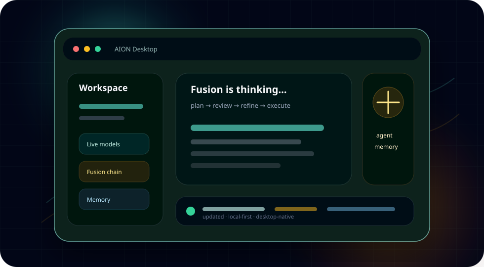

<div align="center">

# ◆ AION — the eternal desktop agent

**A desktop AI agent with a real workspace: it remembers, compares, reviews — and keeps evolving with you.**

[](https://github.com/razekeks1/aion/releases/latest)
[](https://github.com/razekeks1/aion/releases/latest)
[](https://github.com/razekeks1/aion/releases/latest)
[](#the-desktop)
[](#source)

*A terminal is a tool. A chat tab is a box.*
***AION is a home for agents — focused, visual, persistent and built for long sessions.***



</div>

---

## Download

Get the latest Windows installer from the Releases page:

https://github.com/razekeks1/aion/releases/latest

Run `AION-Setup-<version>.exe`, open AION, add your providers and choose your models. That's it.

This repository is used for public downloads and automatic desktop updates. It intentionally does not contain the application source code.

---

## Why this is not just another AI chat app

### ⛛ Fusion Mode

AION can turn a hard prompt into a **plan → review → refine → execute** flow. A fast executor drafts the approach, reviewer models inspect it, and the final response is produced with that extra pressure applied.

Use it for debugging, architecture, reviews, planning, refactors and anything where a single first-pass answer feels too cheap.

```text
You ask
  ↓
Executor drafts the plan
  ↓
Reviewers challenge it
  ↓
AION returns the stronger answer
```

### 🧠 Living Memory

The point of AION is continuity. Your workspace should not feel wiped every time you open it. AION is built around sessions, local settings, remembered context and agent behavior that becomes more useful the longer you work with it.

### ⚡ Live Model Switching

Add providers, fetch model lists live, enable or disable providers, and switch brains from the desktop UI. No terminal setup ritual, no config spelunking, no "where did this key go?" energy.

### 🛡 Local Control

AION keeps your app configuration local. You decide which providers exist, which models are active and when to wipe local app data with the built-in reset flow.

### ↻ Automatic Updates

The desktop app checks GitHub Releases for new versions, downloads the installer and applies updates cleanly. The public repo exists for that: a stable download and update endpoint, not a source dump.

---

## The Desktop

- **Focused chat workspace** — built for actual work, not a throwaway prompt box
- **Provider controls** — add, enable, disable and manage model providers
- **Live model fetching** — model lists refresh from providers when you open the picker
- **Fusion setup** — choose executor and reviewer models from the UI
- **Persistent sessions** — continue where you left off
- **Local reset zone** — wipe saved AION data only after explicit confirmation
- **Version status** — see the installed app version in the UI
- **Update center** — update prompts, progress and installer handoff

---

## Architecture Vibe

```text
                    ┌──────────────────────────────────────┐
                    │           AION Desktop UI             │
                    │  chat · settings · models · updates   │
                    └──────────────────┬───────────────────┘
                                       │
        ┌───────────────┬──────────────┼──────────────┬────────────────┐
        ▼               ▼              ▼              ▼                ▼
 ┌─────────────┐ ┌─────────────┐ ┌─────────────┐ ┌────────────┐ ┌─────────────┐
 │  Providers  │ │   Fusion    │ │   Memory    │ │  Sessions  │ │   Updates   │
 │ live models │ │ plan/review │ │ local-first │ │ resumable  │ │ GitHub EXE  │
 └──────┬──────┘ └──────┬──────┘ └──────┬──────┘ └────────────┘ └──────┬──────┘
        │               │               │                              │
        ▼               ▼               ▼                              ▼
 ┌────────────────────────────────────────────────────────────────────────────┐
 │                         Your agent workspace                              │
 │             persistent · model-flexible · desktop-native                  │
 └────────────────────────────────────────────────────────────────────────────┘
```

---

## vs. Normal AI Apps

| | typical chat apps | **AION** |
|---|---|---|
| Workspace | one conversation box | **desktop agent workspace** |
| Models | one selected model | **provider + live model management** |
| Deep work | one-pass answer | **Fusion review flow** |
| Continuity | easy to lose context | **sessions + local memory direction** |
| Updates | manual downloads | **built-in update flow** |
| Control | hidden cloud defaults | **local configuration and reset** |

---

## Source

AION is currently distributed as a closed-source desktop application.

This public repository intentionally contains only:

- this README and public visual assets
- GitHub Release metadata
- the Windows installer executable

GitHub may show automatic "Source code" links on release pages because it creates them for every tag. AION release tags are kept source-free.

---

<div align="center">

*"Hermes ran fast. Aion never stops."*

</div>
